**Note:** For the screenshots, you can store all of your answer images in the `answer-img` directory.

## Verify the monitoring installation

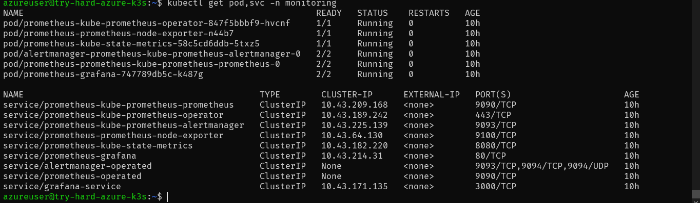
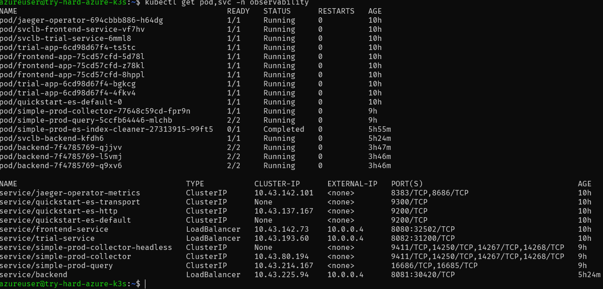

## Setup the Jaeger and Prometheus source

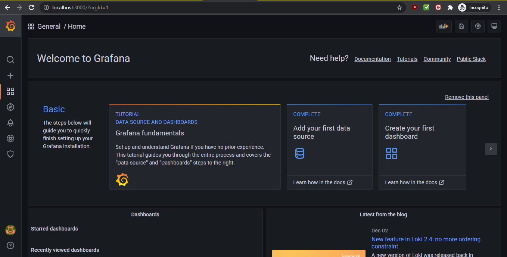
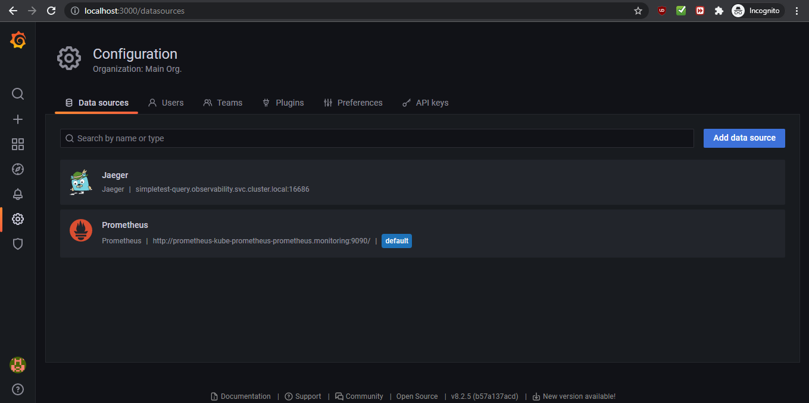
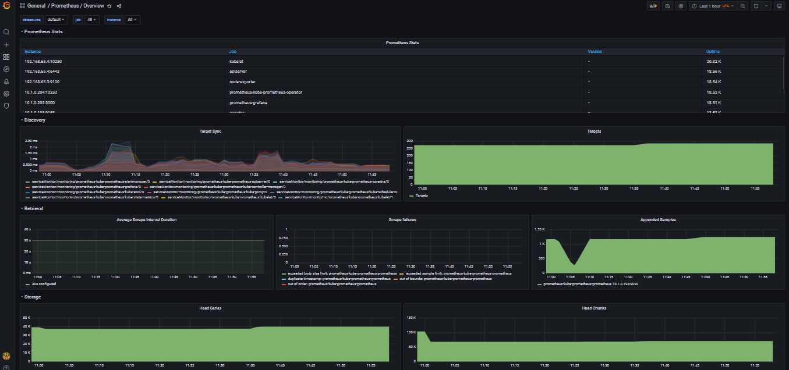

## Create a Basic Dashboard

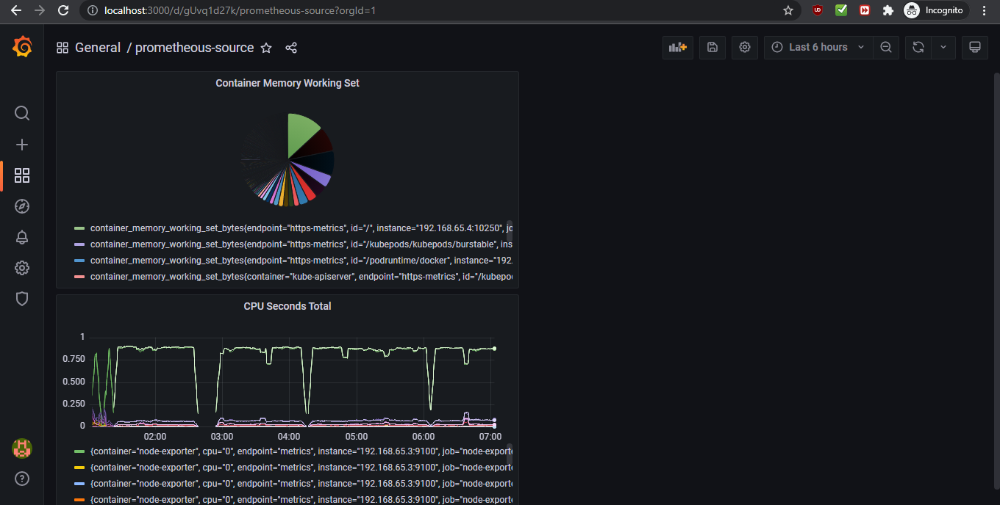

## Describe SLO/SLI

### SLO example:

- Our APIs should not take more than 10 seconds to return data more than 24 times a month.

### SLI example:

- Our APIs took a total of 320 extra seconds to return data, exceeding our latency budget by 80 seconds. We net a 98% uptime.

Here, the SLO is not exceeding latency of 10 seconds more than 24 times in a given month. This aims to ensure service satisfcation among customers, who are then assured a monthly uptime of 99.9%, and will get a response from our APIs within 10 seconds.

The actual SLI is a latency budget of 240 seconds a month, which translates to 99.9% uptime. Our actual measure was keeping track of how long it took to return a request, find the times we exceeded 10s, and adding it up till the end of the month. The SLI is something we actually measured, while the SLO was a goal here we had to meet, and by this example, failed to meet by 80 seconds this month across our customer base. Therefore, we can say that the indicator was how lond it took to serve a request, and the objective was to have high monthly uptime and low latency for our APIS.

## Creating SLI metrics.

- Latency of API response: How long it takes to get a response, which affects the operation of dependants on the API. If the latency is too high, dependants will abandon the API for something with lower latency.
- Success rates: Success rates measured by the 20X or 30X response code.
- Page load time: a customer shoudl only spend a few seconds for a webpage to load, otherwise it will cause disatisfaction.
- Error rates: We should measure our 40X and 50X error rates and ensure that the error is below a threshold level.
- Saturation: Saturation can mean that load is not being evenly distributed or resources might need scaling.

## Create a Dashboard to measure our SLIs

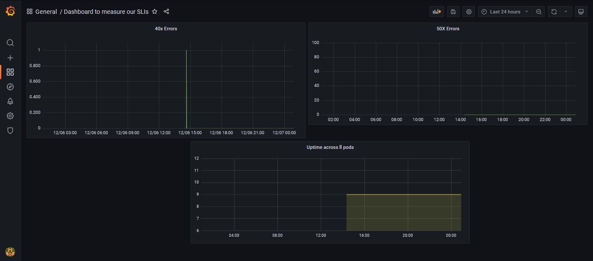

## Tracing our Flask App

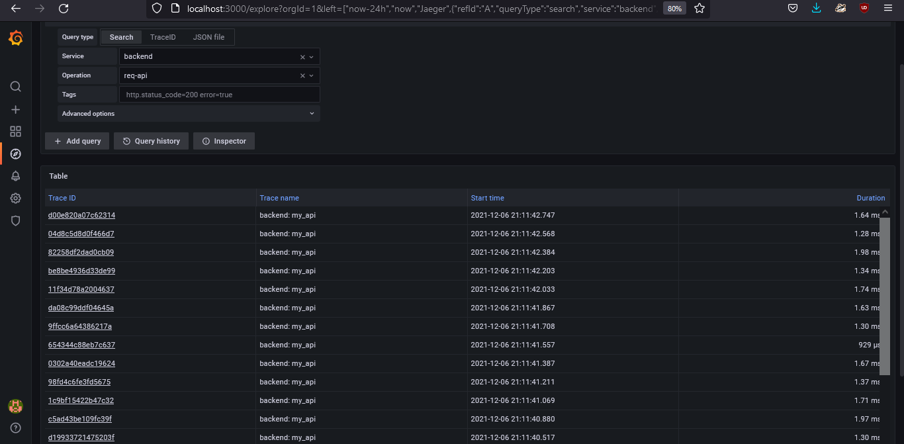

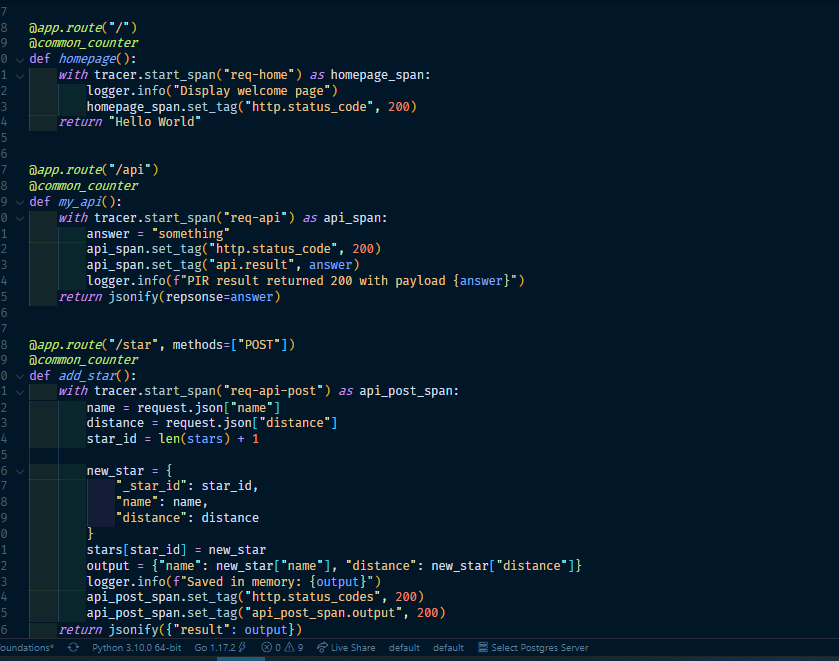

## Jaeger in Dashboards

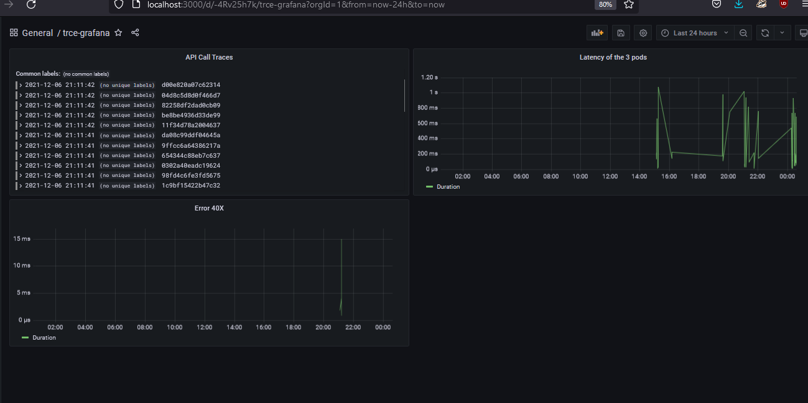

## Report Error

TROUBLE TICKET

Name: Debabrata Bhattacharya

Date: 6th December

Subject: High 404 error rate

Affected Area: Backend API

Severity: High

Description:
The Backend API is geeting a lot of 404 errors due to user error. The file corresponding to that section is `backend\app.py`. 

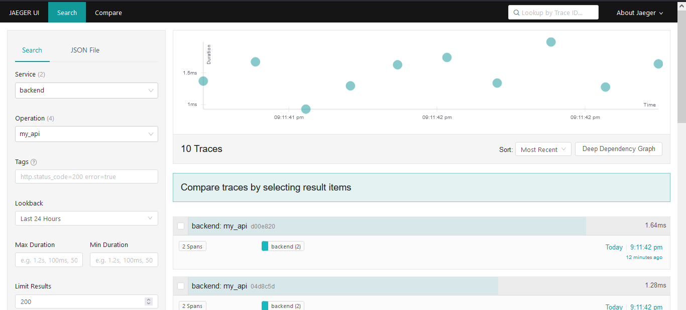

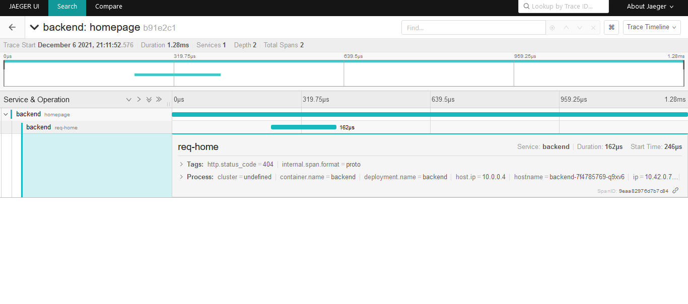

## Creating SLIs and SLOs

1. Latency: Latency is often the indication of an inefficient system. Decreasing latency will incrementally improve the code base and improve the reliability of the system.
2. Saturation: Constant saturation denotes resource scarcity, which can cause downtime due to not enough resources for the applications to run.
3. The amount of traffic throughput  is a good indicator to measure. Increasing availability will prevent peak traffoc to cause downtime.
4. Error rate. Having a high error rate directly corresponds to increased downtime.

## Building KPIs for our plan

- Monitoring of CPU utilization and error rates during deployments, for developing a profile of the system.
  - Why: So that we can later provision higher resources in advance, minimizing downtime.
- Total resource utilization (CPU) is always below a threshold less than 0.75, or 75%.
  - Why: This gives us a buffer of 25% before we need to face downtime due to unavailability of resources.
- Reduce latency of key services to 100ms max response times from 1000ms.
  - Why: Refactoring our most latency prone services will decrease the amount of latency throughout the clusters, and improves the overall health of the system.
- Adding a caching solution infront of all services that have latency higher than 50ms.
  - Why: This immediately improves response time, since quick retireval of response from a cache gurantees a faster turnaround time.
- During high traffic, error rate remains less than 1%.
  - Why: If we can manage a less than 1% error rate even under heavy traffic conditions by provisioning more resources automatically, we can potentially reduce overall downtime to less than 1%. Heavy load can also cause saturation, which also reduces uptime.
- High traffic doesn't cause network saturation.
  - Why: Changing our architecture and applications to more gracefully support heavy traffic conditions will reduce spending on infrastructure during peak hours, where most of the dynamic cost comes from.
- Saturation (pods/node) is less than 50% capacity of the node during normal hours and max 90% of the capacity during peak hours.
  - Why: Refactoring the applications to handle traffic better, using caching solutions, and improving the architecture will reduce saturation, and therefore downtime due to insufficient resources.
- Reduction of 40X errors to less than 10% by the end of the month.
  - Why: High rate of current 40X errors is probably due to user error. Improvements in user experience and investment in user interface design will improve usability and reduce user dissatisfaction. This will also prevent downtime due to too many errors overwhelming the system.

## Final Dashboard

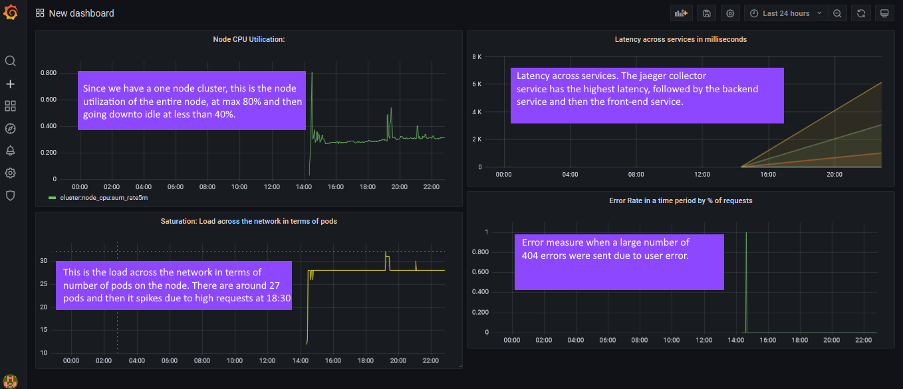